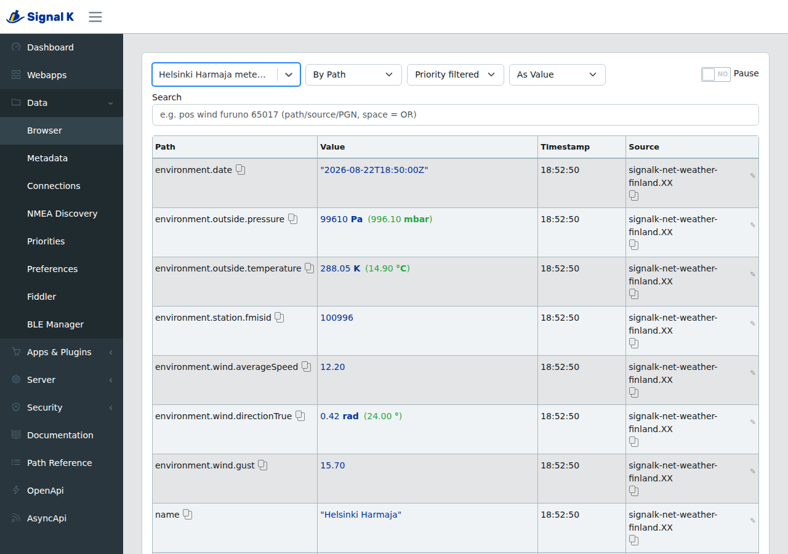
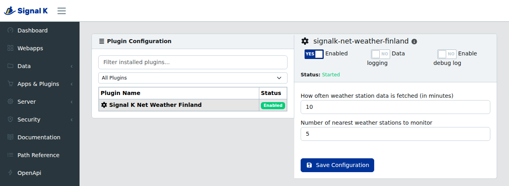

# Signal K Weather Station Plugin

[](https://github.com/KEGustafsson/signalk-net-weather-finland/actions/workflows/ci.yml)

This plugin fetches weather data from Finnish Meteorological Institute coastal weather stations for Signal K. It automatically selects nearby stations, providing weather updates for maritime navigation.

## Screenshots

Live observations from the nearest stations in the Signal K data browser:



Plugin configuration:



## Features

- Fetches data from the nearest Finnish Meteorological Institute coastal weather stations
- Automatically selects stations based on vessel position using haversine distance
- Configurable number of monitored stations (1-51)
- Configurable update interval (minimum 10 minutes)
- Fetch timeout (30s) and concurrency guard prevent hangs and overlapping requests
- Handles missing sensor data gracefully (NaN values are excluded)
- Provides the following weather data per station:
  - Station name and short name
  - FMISID (station identifier)
  - Station position (latitude/longitude)
  - Temperature (Kelvin)
  - Wind speed (m/s)
  - Wind gust (m/s)
  - Wind direction (radians, true)
  - Atmospheric pressure (Pa)
  - Observation timestamp

## Data Source

This plugin fetches weather observation data directly from the [Finnish Meteorological Institute Open Data](https://en.ilmatieteenlaitos.fi/open-data) WFS API (`opendata.fmi.fi`). The data is freely available under the [Creative Commons Attribution 4.0](https://creativecommons.org/licenses/by/4.0/) license. No API key is required.

The plugin queries the `fmi::observations::weather::timevaluepair` stored query for each station using its FMISID, requesting the following parameters: `t2m`, `ws_10min`, `wg_10min`, `wd_10min`, `p_sea`.

## Signal K Paths

Weather data is published under the `meteo` context with the following paths:

| Path | Description | Unit |
|------|-------------|------|
| `environment.station.fmisid` | FMI station identifier | - |
| `navigation.position` | Station coordinates | lat/lon |
| `environment.outside.temperature` | Air temperature | Kelvin |
| `environment.wind.averageSpeed` | Wind speed (10 min avg) | m/s |
| `environment.wind.gust` | Wind gust speed | m/s |
| `environment.wind.directionTrue` | Wind direction (true) | radians |
| `environment.outside.pressure` | Sea level pressure | Pascal |
| `environment.date` | Observation timestamp | ISO 8601 |

## Usage

Once installed and configured, the plugin will automatically fetch data from the nearest weather stations to your boat's location. Station weather data is available under the meteo context.

Freeboard-SK is able to show meteo data and this needs to be enabled from settings.

## Configuration

Plugin settings:

- **Data fetching interval** -- how often to fetch (minimum 10 minutes)
- **Number of stations** -- how many nearest stations to monitor (1-51)

## Development

### Prerequisites

- Node.js 18 or later to run the plugin (uses native `fetch`)
- Node.js 21 or later to run the test suite (`npm test` relies on the
  test runner expanding `test/**/*.js` itself)

### Setup

```bash
npm install        # Install dependencies
npm run build      # Compile TypeScript to dist/
```

### Scripts

```bash
npm run clean       # Clean dist/ output folder
npm run build       # Compile TypeScript
npm run typecheck   # Type-check without emitting
npm test            # Build and run tests (Node built-in test runner)
npm run lint        # Run linter (ESLint + TypeScript typecheck)
npm run audit-check # Check for vulnerabilities
```

### Continuous Integration

Two workflows run on every push and pull request:

- [`signalk-ci.yml`](.github/workflows/signalk-ci.yml) calls the canonical
  Signal K plugin CI workflow from `SignalK/signalk-server`, which builds and
  tests the plugin on Linux x64, Linux arm64, macOS and Windows against Node 22
  and 24. armv7/Cerbo GX emulation and the Signal K server integration test are
  off by default and can be switched on per-run from the Actions tab via
  `workflow_dispatch`. armv7 is off because it runs Node 20, and `npm test`
  needs Node 21 or later (see Prerequisites).
- [`ci.yml`](.github/workflows/ci.yml) covers what the shared workflow doesn't:
  ESLint, `tsc --noEmit` and `npm audit`. The audit also runs weekly, so newly
  published advisories surface without a push.

No `package-lock.json` is committed, so CI installs with `npm install` rather
than `npm ci`.

### Project Structure

```
src/
  index.ts          # Plugin source
  types.ts          # TypeScript interfaces
test/
  plugin-runtime.test.js   # Comprehensive test suite
  tooling.test.js          # Build artifact verification
docs/screenshots/   # Listing images, referenced by signalk.screenshots
dist/               # Compiled output (gitignored)
```

## Support

For any issues or inquiries, please [open an issue](https://github.com/KEGustafsson/signalk-net-weather-finland/issues) on the GitHub repository. We welcome any feedback or contributions.

## License

This project is licensed under the MIT License. Feel free to modify and distribute it according to the terms of the license.
